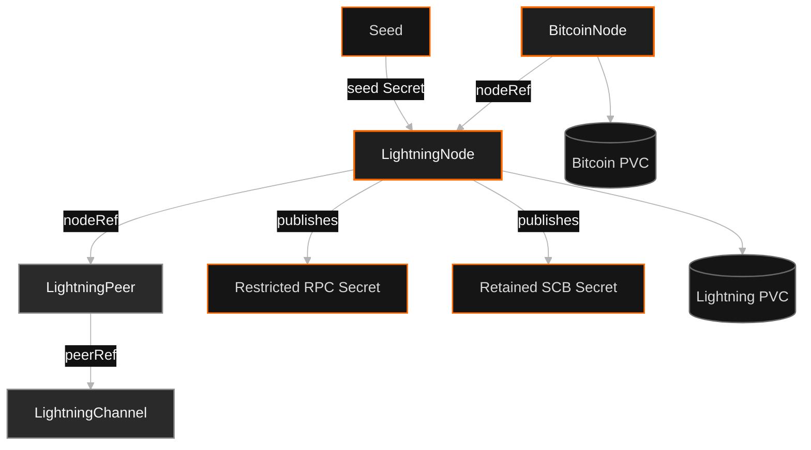
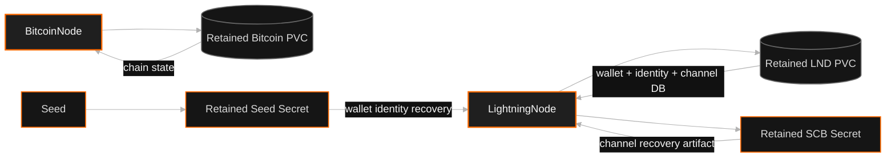

# Kiln

[](https://github.com/kiln-fired/kiln-operator/actions/workflows/push.yaml?query=branch%3Amain)
[](https://github.com/kiln-fired/kiln-operator/actions/workflows/lightning-e2e.yaml?query=branch%3Amain)


Kiln is a Kubernetes operator for running Bitcoin and Lightning infrastructure with explicit lifecycle, persistence, recovery, and credential-management semantics.

The implementation is intentionally focused:

- **Bitcoin:** [btcd](https://github.com/btcsuite/btcd)
- **Lightning:** [LND](https://github.com/lightningnetwork/lnd)
- **Wallet initialization:** [lndinit](https://github.com/lightninglabs/lndinit)
- **API model:** namespaced Kubernetes custom resources managed by controller-runtime

Kiln is built around one principle: stateful Bitcoin and Lightning infrastructure should survive ordinary Kubernetes operations predictably. Pod replacement, controller restart, rescheduling, and custom-resource deletion/recreation should not silently destroy identity or recovery-critical state.

> [!IMPORTANT]
> Kiln is under active development. Mainnet requires explicit opt-in. Kiln retains LND Static Channel Backups and Seed output Secrets inside Kubernetes, but external backup replication, stronger seed custody, and application-level payment APIs are not yet part of the supported contract.

## At a glance

Kiln currently provides five first-class APIs.

| Resource | Purpose |
| --- | --- |
| `BitcoinNode` | Runs persistent btcd infrastructure and exposes RPC |
| `LightningNode` | Runs persistent LND backed by a managed or external Bitcoin node |
| `LightningPeer` | Declares durable desired LND peer connectivity |
| `LightningChannel` | Declares a funded Lightning channel and its lifecycle |
| `Seed` | Generates or imports LND-compatible seed material through Kubernetes Secrets |

The resource graph is declarative and reference-based:



References are same-namespace and fixed-kind. Kiln CRs do not form a Kubernetes ownership tree with one another. Ownership is reserved for implementation resources such as StatefulSets and Services, while recovery artifacts may deliberately outlive the CR that produced them.

## What Kiln guarantees

The most important behaviors are explicit rather than incidental:

- persistent Bitcoin and Lightning storage
- `ReadWriteOncePod` fencing for stateful workloads
- graceful node shutdown and finalizer-based deletion
- retained LND identity across pod and CR recreation
- retained LND Static Channel Backups
- retained Seed output Secrets
- Secret-backed seed import instead of plaintext mnemonic/passphrase fields
- restricted LND client credentials without exporting `admin.macaroon`
- authenticated LND runtime readiness through `GetInfo`
- explicit mainnet opt-in
- declarative Bitcoin persistent peer sets
- declarative Lightning peer and channel reconciliation
- crash-safe Lightning channel ownership through persisted LND memos
- real-cluster destructive recovery testing

## Runtime baseline

| Component | Default |
| --- | --- |
| Bitcoin | `ghcr.io/btcsuite/btcd:v0.26.2` |
| Lightning | `docker.io/lightninglabs/lnd:v0.21.0-beta` |
| Wallet init | `docker.io/lightninglabs/lndinit:v0.1.36-beta-lnd-v0.21.0-beta` |
| Go | 1.26 |
| Kubernetes libraries | 0.37 |
| controller-runtime | 0.25 |

Container images remain configurable, but Kiln does not currently abstract across multiple Bitcoin or Lightning implementations.

## Quick start shape

A managed LND node references a same-namespace Bitcoin node:

```yaml
apiVersion: bitcoin.kiln-fired.github.io/v1alpha1
kind: BitcoinNode
metadata:
  name: btcd
spec:
  network: simnet
  rpcServer:
    certSecret: btcd-rpc-tls
    apiAuthSecretName: btcd-rpc-creds
    apiUserSecretKey: username
    apiPasswordSecretKey: password
---
apiVersion: bitcoin.kiln-fired.github.io/v1alpha1
kind: LightningNode
metadata:
  name: lnd
spec:
  bitcoinConnection:
    nodeRef: btcd
  rpc:
    secretName: lnd-rpc
  wallet:
    password:
      secretName: lnd-wallet
      secretKey: password
    seed:
      secretName: lnd-seed
      mnemonicKey: mnemonic
      passphraseKey: passphrase
```

See [config/samples](config/samples) for complete examples.

## Resource naming and ownership

Fresh node workloads use type-qualified child names so different CR kinds may safely share the same name.

| CR | StatefulSet | Service |
| --- | --- | --- |
| `BitcoinNode/foo` | `foo-bitcoin` | `foo-bitcoin` |
| `LightningNode/foo` | `foo-lightning` | `foo-lightning` |

Kiln verifies controller ownership before using, mutating, or deleting an existing child resource. It will not adopt an unrelated StatefulSet, Service, or Secret merely because its name matches.

Existing installations remain recovery-compatible. If Kiln finds an owned legacy StatefulSet or a retained legacy PVC, that node continues using its pre-change resource name so an upgrade does not strand persisted data.

## BitcoinNode

`BitcoinNode` manages a persistent btcd node, its RPC Service, storage, network safety policy, mining controls for development networks, and an optional desired set of persistent peers.

### Storage

Storage capacity and StorageClass are configured at creation time:

```yaml
spec:
  storage:
    size: 1Ti
    storageClassName: fast-storage
```

Defaults:

- size: `2Gi`
- StorageClass: cluster default
- access mode: `ReadWriteOncePod`

The storage configuration is immutable. Kiln does not treat CR edits as a generic PVC resize or migration mechanism. Retained PVCs remain authoritative during deletion/recreation recovery.

### Persistent peers

`spec.peers` declares the persistent btcd peers Kiln should manage:

```yaml
spec:
  peers:
    - node-a.example.com:8333
    - node-b.example.com:8333
```

Kiln treats this as a desired set:

- missing desired peers are added persistently
- peers previously managed by Kiln are removed when they leave the set
- already-persistent desired peers are adopted without reconnecting
- manually-added persistent peers outside Kiln are preserved
- DNS-discovered and transient peers are unaffected

`status.managedPeers` records Kiln's ownership boundary and `PeersReady` reports reconciliation health.

An empty `spec.peers` means "Kiln manages no static peers." It does not mean "disconnect the node from Bitcoin."

## LightningNode

`LightningNode` manages persistent LND identity, wallet initialization, Bitcoin dependency resolution, restricted RPC publication, runtime status, and recovery artifacts.

### Persistent identity

LND stores state on a retained `ReadWriteOncePod` PVC. The StatefulSet uses:

- one replica
- `ReadWriteOncePod` fencing
- `OnDelete` update strategy
- retained PVCs on StatefulSet deletion or scale-down
- a 60-second termination grace period
- graceful `lncli stop`

Wallet initialization is idempotent through lndinit. If wallet state already exists, Kiln validates and reuses it rather than creating a new identity.

### Bitcoin dependency

A managed LND node references a `BitcoinNode`:

```yaml
spec:
  bitcoinConnection:
    nodeRef: btcd
```

Kiln derives the Bitcoin network, Service hostname, TLS Secret, and RPC credential references from that node.

An external Bitcoin backend can be declared instead:

```yaml
spec:
  bitcoinConnection:
    external:
      host: btcd.example.com:18556
      network: signet
      certSecret: btcd-rpc-tls
      apiAuthSecretName: btcd-rpc-creds
      apiUserSecretKey: username
      apiPasswordSecretKey: password
```

Exactly one of `nodeRef` or `external` is allowed.

### Runtime readiness

Pod readiness is not enough to mark LND healthy. Kiln performs an authenticated LND `GetInfo` call and exposes the observed runtime state.

```yaml
status:
  phase: Ready
  rpcAddress: lnd-lightning.bitcoin.svc.cluster.local:10009
  rpcSecretName: lnd-rpc
  runtime:
    identityPubkey: 03...
    alias: my-node
    version: 0.21.0-beta
    blockHeight: 123456
    syncedToChain: true
    syncedToGraph: true
    numPeers: 2
    numPendingChannels: 0
    numActiveChannels: 3
    numInactiveChannels: 0
```

Important conditions include:

| Condition | Meaning |
| --- | --- |
| `NetworkReady` | Network and mainnet policy are valid |
| `BitcoinReady` | The configured Bitcoin backend is available |
| `StorageFenced` | The Lightning volume is restricted to one pod |
| `WalletReady` | The wallet is initialized and usable |
| `CredentialsReady` | Restricted client credentials are published |
| `BackupReady` | A non-empty LND Static Channel Backup is published |
| `RuntimeReady` | Authenticated LND `GetInfo` succeeds |
| `Ready` | The node is operational |

### Restricted client access

Kiln publishes a client Secret, by default:

```text
<lightning-node-name>-rpc
```

It contains:

| Key | Purpose |
| --- | --- |
| `tls.cert` | Trust the LND endpoint |
| `readonly.macaroon` | Read-only LND access |
| `invoice.macaroon` | Invoice-oriented LND access |

Kiln does not export `admin.macaroon`.

```shell
lncli --network simnet \
  --rpcserver lnd-lightning.bitcoin.svc.cluster.local:10009 \
  --tlscertpath ./tls.cert \
  --macaroonpath ./readonly.macaroon \
  getinfo
```

## LightningPeer

`LightningPeer` represents durable desired connectivity, not a one-shot `lncli connect`.

```yaml
apiVersion: bitcoin.kiln-fired.github.io/v1alpha1
kind: LightningPeer
metadata:
  name: routing-peer
spec:
  nodeRef: lnd
  pubkey: 02aaaaaaaaaaaaaaaaaaaaaaaaaaaaaaaaaaaaaaaaaaaaaaaaaaaaaaaaaaaaaaaa
  address: peer.example.com:9735
```

Kiln observes LND before taking action. If the peer is already connected, reconciliation is satisfied. If it is absent, Kiln waits for the referenced Lightning node to be usable before requesting a persistent connection.

`nodeRef` and `pubkey` are immutable. The address may be updated and is used the next time a connection must be established.

Deleting a `LightningPeer` is blocked while a `LightningChannel` still references it. Once dependent channels are gone, Kiln requests a clean LND disconnect before releasing the finalizer.

## LightningChannel

`LightningChannel` represents a channel that should exist through a declared `LightningPeer`.

```yaml
apiVersion: bitcoin.kiln-fired.github.io/v1alpha1
kind: LightningChannel
metadata:
  name: alice-to-bob
spec:
  peerRef: bob
  capacitySats: 100000
  private: true
  minConfs: 1
```

Kiln observes LND before funding. Existing pending or open Kiln-owned channels are rediscovered rather than duplicated.

Each funding workflow is tagged with a memo derived from the `LightningChannel` UID. LND persists that memo in pending and open channel records, giving Kiln durable ownership identity across controller restarts and crash windows.

Kiln does not adopt unrelated channels merely because they share a peer or capacity.

Deletion reconciles toward channel absence through cooperative close. Kiln does not automatically force-close a channel when cooperative close is blocked.

## Seed

`Seed` is a development-oriented helper for generating or importing LND-compatible aezeed material.

Sensitive mnemonic and passphrase values are never stored directly in the Seed custom resource.

Generate new material:

```yaml
apiVersion: bitcoin.kiln-fired.github.io/v1alpha1
kind: Seed
metadata:
  name: lnd
spec:
  secretName: lnd-seed
  network: simnet
```

Import existing material from another Secret:

```yaml
apiVersion: v1
kind: Secret
metadata:
  name: lnd-seed-import
stringData:
  mnemonic: "<24-word aezeed mnemonic>"
  passphrase: "<aezeed passphrase>"
---
apiVersion: bitcoin.kiln-fired.github.io/v1alpha1
kind: Seed
metadata:
  name: lnd
spec:
  secretName: lnd-seed
  network: simnet
  import:
    secretName: lnd-seed-import
    mnemonicKey: mnemonic
    passphraseKey: passphrase
```

Kiln publishes the resulting mnemonic, passphrase, and derived root key only into the output Secret.

The output Secret is intentionally retained independently of the `Seed` CR. Deleting and recreating the CR therefore does not garbage-collect recovery material.

Existing legacy controller-owned Seed Secrets are migrated in place to retained semantics without changing their bytes.

If a previously-ready generated Seed Secret disappears, Kiln reports `SeedMaterialLost` instead of silently generating a different wallet identity. Imported seed output can be reconstructed from the declared source Secret.

## Recovery model

Kiln distinguishes reconstructable runtime state from identity and recovery material.



Recovery-critical artifacts deliberately do not always share the lifecycle of the CR that produced them.

### Static Channel Backup

Kiln continuously copies LND's native `channel.backup` into a retained Secret named:

```text
<lightning-node-name>-scb
```

The Secret is not owned by the `LightningNode`, so deleting and recreating the CR does not garbage-collect the backup.

`BackupReady=True` means a non-empty SCB has been published.

The SCB is not a replacement for wallet seed custody or off-cluster backup. Production operators should replicate recovery material into storage with failure characteristics independent of the Kubernetes cluster.

## Network and mainnet safety

Supported Bitcoin networks:

- `simnet`
- `testnet`
- `regtest`
- `signet`
- `mainnet`

`BitcoinNode` defaults to `simnet`. A managed `LightningNode` derives its network from the referenced Bitcoin node.

Mainnet requires explicit opt-in:

```yaml
spec:
  network: mainnet
  safety:
    allowMainnet: true
```

For a managed Lightning node:

```yaml
spec:
  bitcoinConnection:
    nodeRef: bitcoin-mainnet
  safety:
    allowMainnet: true
```

Kiln refuses development-oriented automatic mining controls on mainnet.

If a running resource becomes blocked by network policy, Kiln gracefully removes its StatefulSet while retaining persistent state so the same node can recover once the policy is corrected.

## Recovery guarantees we test

Kiln includes a destructive real-cluster E2E test built on kind.

The test exercises a real btcd + LND stack and verifies:

- normal startup
- operator restart
- LND pod deletion and recreation
- RPC credential Secret deletion and republishing
- complete `LightningNode` deletion and recreation against retained storage
- stable LND identity across recovery
- retained Static Channel Backup survival
- generated Seed Secret survival across Seed CR deletion/recreation
- declarative Lightning peer and channel lifecycle
- crash-safe channel rediscovery
- peer deletion blocking while channels still depend on it
- cooperative channel close
- declarative Bitcoin persistent peer add/remove behavior against real btcd

The destructive E2E runs on relevant PRs and pushes, nightly on `main`, and through manual workflow dispatch.

## Security model

Current defaults intentionally favor limited authority:

- wallet passwords and seed material are referenced through Secrets
- plaintext Seed mnemonic/passphrase values are not stored in CRs
- generated/imported Seed output Secrets are retained
- public LND client credentials exclude admin access
- administrative reconciliation credentials remain internal
- credential publishing is RBAC-scoped
- unrelated Secrets, StatefulSets, and Services are not silently adopted
- stateful node volumes use single-pod fencing
- persistent Lightning state is retained instead of silently destroyed
- LND Static Channel Backups are continuously published to retained Secrets
- mainnet requires explicit opt-in

Kiln does not currently provide automated off-cluster backup or hardware-backed seed custody. Operators remain responsible for the durability and security of the Kubernetes storage and Secret systems beneath Kiln.

## Local development

### Requirements

- Go 1.26
- Docker with BuildKit
- `kubectl` or `oc`
- access to a Kubernetes cluster for deployment testing

Project tooling such as controller-gen, Kustomize, and setup-envtest is installed into `./bin` by the Makefile.

### Test

```shell
make test
```

Controller tests use controller-runtime `envtest`, so an existing cluster is not required.

### Build

```shell
make build
```

### Regenerate API artifacts

```shell
make generate
make manifests
```

### Run locally

```shell
make install
make run
```

### Build and deploy an operator image

```shell
export IMG=quay.io/kiln-fired/kiln-operator:dev

make docker-build IMG="$IMG"
make docker-push IMG="$IMG"
make deploy IMG="$IMG"
```

## OLM bundle

```shell
export IMG=quay.io/kiln-fired/kiln-operator:latest
export BUNDLE_IMG=quay.io/kiln-fired/kiln-operator-bundle:latest

make bundle IMG="$IMG" VERSION=0.0.1 DEFAULT_CHANNEL=alpha
make bundle-build BUNDLE_IMG="$BUNDLE_IMG"
make bundle-push BUNDLE_IMG="$BUNDLE_IMG"

operator-sdk bundle validate "$BUNDLE_IMG"
```

For a local bundle install:

```shell
operator-sdk run bundle "$BUNDLE_IMG"
```

## Scope

Kiln's current milestone is a trustworthy Kubernetes substrate for btcd and LND.

The project intentionally avoids abstracting across multiple implementations until real requirements justify the additional API surface.

Next areas under consideration include:

- off-cluster backup and recovery integration
- stronger seed custody models
- additional Bitcoin or Lightning implementations when concrete use cases justify them
